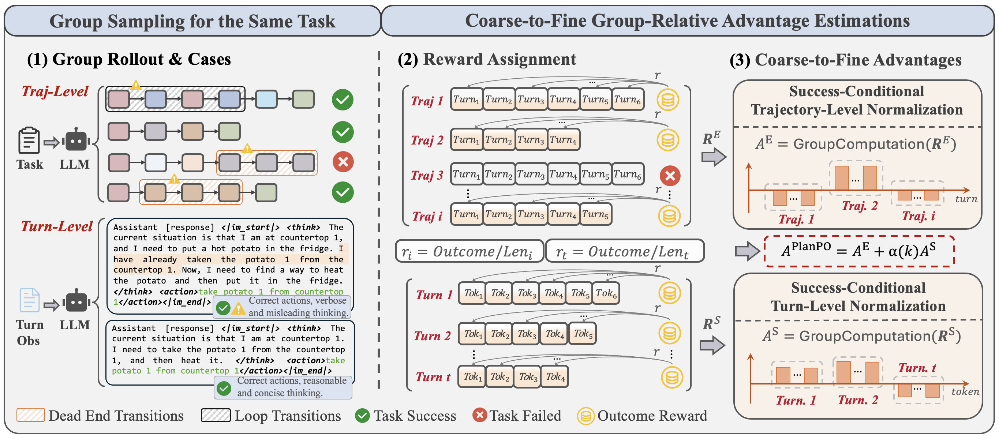
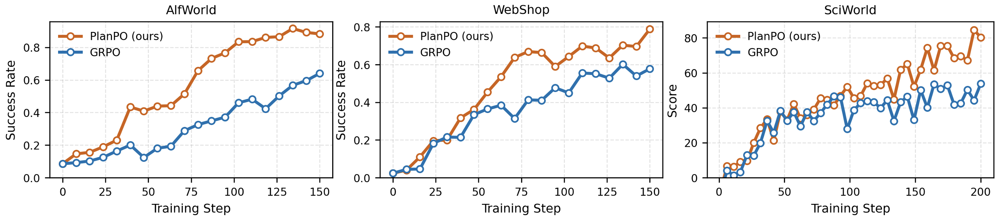

<h3 align="center">
<b>PlanPO: PlanPO: Group Planning-Aware Policy Optimization for Multi-Turn Agentic LLMs.</b>
 
<b>arXiv Preprint</b>
</h3>

  
  &nbsp;
  
  &nbsp;
  
  &nbsp;

`PlanPO` a simple yet effective RL method for learning generalizable planning abilities beyond task-specific high-quality behavior patterns.

 Our key observation is that many inefficiencies in agentic RL manifest as excessive interaction or generation length. In multi-turn interactions, agents may hesitate between states, repeatedly visit similar observations, or enter dead ends before eventually completing the task. A similar issue arises in token-level textual responses. Given the same question or turn-level observation, sampled responses may produce correct actions while still containing unnecessarily verbose, convoluted, or even logically flawed reasoning traces. Nevertheless, both inefficient turns and reasoning tokens can still share identical success rewards just like the superior solutions. Crucially, treating such heterogeneous successes as equally preferable weakens distinguishable signals and the underlying abilities, while allowing noisy rollouts to degrade training quality and impose substantial performance bottlenecks.

# PlanPO Framework

    

 To address this, we present **Group Planning-aware Policy Optimization (PlanPO)**, an effective group-based RL method for learning generalizable planning abilities beyond specific planful behaviors. Specifically, `PlanPO` introduces coarse-to-fine advantage signals, which capture the relative differences in {trajectory-level} lengths and turn-level response lengths {conditioned on successful trajectories} sampled for the same task. Within the group-relative optimization structure, this enables agents to actively learn generalizable and deliberate behaviors spanning interaction planning and textual generation from high-quality rollouts, without degenerating into vanilla length minimization.
 
 Experimentally, `PlanPO` improves over GRPO by \textbf{27.2\%} on average across the challenging multi-turn benchmarks ALFWorld, WebShop, and SciWorld, outperforming recent powerful baselines while incurring negligible additional training cost.

# Experiments

    

The Figure compares the performance results of PlanPO and GRPO using Qwen2.5-1.5B across ALFWorld, WebShop, and SciWorld. PlanPO consistently improves faster and reaches higher final task success rate (in ALFWorld and WebShop) and score (in SciWorld) than GRPO in all three environments. On ALFWorld, PlanPO shows a clear acceleration after early exploration and eventually approaches around $91\%$ success, while GRPO improves more slowly and remains below $65\%$. On WebShop, both methods improve steadily, but PlanPO maintains a persistent advantage after the middle stage of training. On the more exploratory SciWorld benchmark, PlanPO also achieves higher scores despite larger performance fluctuations.